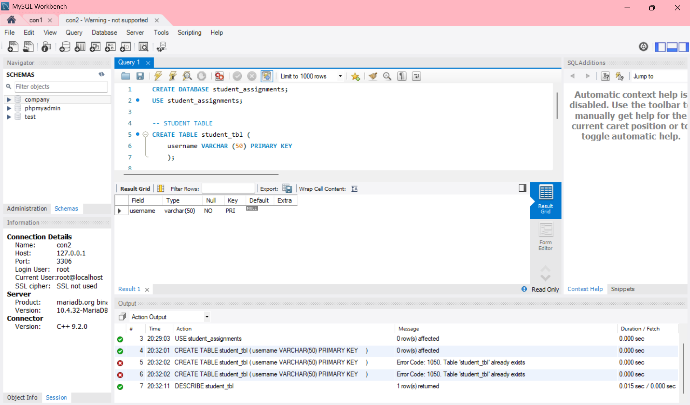
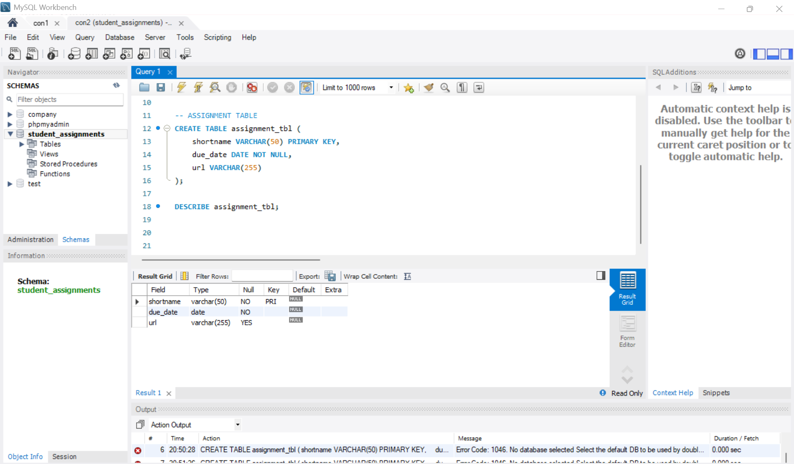
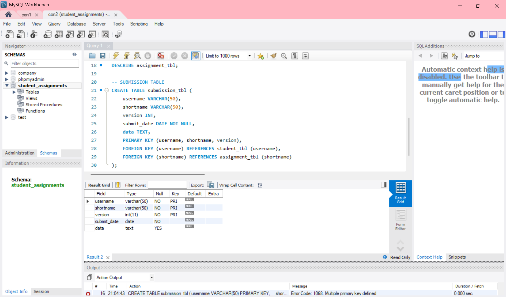

# Finals Lab Task 2 - Transforming ER Model to Relational Tables
In this lab activity, I changed an ER (Entity-Relationship) model into MySQL tables. The ER model showed how students submit their assignments. I created tables for students, assignments, and submissions. I also added primary and foreign keys to connect the tables properly. 

Here are the steps I followed:
- Created a new database
  - Used CREATE DATABASE to make the database.
  - Used USE to select the database.
- Created the main tables
  - Student Table – Added student_id, student_name, and email using INT and VARCHAR.
  - Assignment Table – Added assignment_id, title, description, and due_date.
  - Submission Table – Added submission_id, student_id, assignment_id, and submission_date.
- Connected the tables
  - Used PRIMARY KEY in each table to set the main ID.
  - Used FOREIGN KEY in the Submission table to link it to the Student and Assignment tables.
  - Added ON DELETE CASCADE and ON UPDATE CASCADE to keep data linked correctly.
- Checked the table structure
  - Used DESCRIBE to check each table's design.
  - Exported the ER Diagram or relational schema from phpMyAdmin or MySQL Workbench.

## Here's the screenshot of my output for the Student's table (See screenshot)

## Here's the screenshot of my output for the Assignment's table (See screenshot)

## Here's the screenshot of my output for the Submission's table (See screenshot)

## Here's the screenshot of my output for the ER Diagram/Relational Schema (See screenshot)

